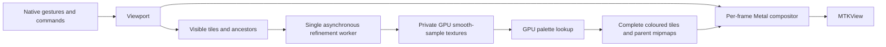

# Renderer architecture through 2.1

The viewer draws from a quadtree cache while motion or refinement changes the image,
and pauses when settled. Refinement runs
independently, so moving the camera does not wait for a full-resolution render.
The CPU implementations remain available as numerical references and developer
overrides. `Mandelbrot/Core` also builds as a Swift package for unit tests.

## Samples, precision and keys

`TileGrid` uses 256×256 interior samples and a one-sample gutter on every edge.
A level-L tile spans `3 / 2^L` of the complex plane. Keys contain a level, signed
anchor-relative indices and an anchor epoch; negative parent indices use floor
division. Rebase when indices exceed 2³⁰, retaining detailed old-generation coverage
using its original precise bounds. Deep coordinates use MIT BigInt fixed point;
spans and local geometry retain a separate binary exponent.

`Viewport` owns coordinate conversion and logarithmic zoom. Automatic precision
uses Float while pixel spacing has adequate Float-ULP headroom, then FloatFloat,
then perturbation. All Metal arithmetic paths retain strict arithmetic. Tile origins
and increments are split on the CPU, avoiding per-pixel FloatFloat division.
Raw RG32Uint records hold an exact UInt32 escape iteration and the bits of a
Float32 smooth correction, using bailout radius 256. Counts 0xffffffff,
0xfffffffe and 0xfffffffd denote capped, unfinished and glitched respectively.
Capped means unresolved, not proven interior. FloatFloat division reduces palette
phase before combining its fractional parts, retaining colour detail at one
million iterations. Raw records cost eight bytes per sample; tile budgeting uses
the textures’ actual allocated sizes.

## Work and presentation

`TileStore` runs one worker, including across cancellation: a replacement worker
starts only after the old command completes. Required work is restricted to the
visible level and its two nearest ancestors, coarse before fine within that band,
then centre before edges. Cold jumps therefore get useful nearby detail without
computing every level from the root. Invisible work is discarded between commands. An orbit
state buffer makes iteration batches resumable; measured GPU duration adapts the
batch toward 1 ms: 8–512 ordinary iterations, or 1–128 perturbation/BLA
operations over one 258² tile. All kernels
use rounded-up uniform threadgroups and reject out-of-range threads before memory
access; non-uniform threadgroup support is not required. This bounds
submitted arithmetic, not OS scheduling latency or a guaranteed frame deadline.

`GPUCanvas` requests the display's maximum refresh rate and permits at most two
presentation commands in flight. It transforms cached tiles with the current
camera; texture readback exists only for tests and exports. Perturbation reads
a small shared status buffer to select a glitched pixel for re-referencing. Scene deactivation and
canvas removal stop refinement and motion. CPU overrides use the legacy image
presentation path; their separate input clocks run only during CPU inertia.
Tile completion, palette changes and navigation wake a paused view; motion and
unfinished fades sustain its timer. Unchanged demand returns before allocating
sets or updating LRU state. The hardware HUD distinguishes drawable presentation
cadence from GPU execution time; simulator presentation timestamps are unavailable.
An explicit iOS plist enables ProMotion timing hints and is checked in the built
app by `make ios` and `make ios-device`.

Tile/operation failures receive at most three attempts with delayed retries.
A terminal failure stays stopped until explicit retry or a render-generation reset.
A visible error notice provides recovery even when the developer HUD is hidden.

Each visible cell finds cached ancestors and blends the two nearest levels
according to fractional LOD. New detail fades in over 125 ms. All filtering and
level blending operates on colours, never interpolated escape counts. The debug
overlay draws cell borders and base-level labels in the fragment shader.
Iteration changes retain reusable records. Decreases recolour existing samples
with the new cap and rebuild colour mipmaps. Increases lazily replace insufficient
tiles, copying escaped samples byte-for-byte and recomputing only capped pixels.
A two-word GPU summary records capped-pixel count and maximum escaped iteration;
fully escaped tiles satisfy any later cap. Raw samples never lose their original
computed limit. Orbit state remains worker-local, so capped pixels currently
restart rather than retaining multi-megabyte state for every cached tile.

When all four children exist, a compute kernel averages their coloured pixels
2×2 into the parent's interior. Its gutter remains directly sampled. Raw parent data stays authoritative. Palette changes recolour raw
samples into replacement textures, swap the palette transaction together, and
rebuild derived mipmaps upward. Seven immutable lookup textures are shared. This costs GPU colouring work, but no fractal
iterations or CPU pixel conversion; changing a palette is not literally free.

## Cache policy

Budgets are 150 MiB on iOS and 500 MiB on Mac. Accounting uses Metal's allocated
texture sizes, including colour copies and gutters, rather than assuming a tile
is only its 256 KiB raw payload. Two thirds of the budget, less scratch headroom,
are available for resident tiles; the rest covers recolouring, orbit state and
transient replacements. This is a cache budget, not a cap on total app memory.

Visible tiles and their two nearest ancestor levels are protected. Distant ancestors
remain reusable LRU entries. A separate coverage pyramid reserves up to 30 MiB
and 40 tiles from bytes left after the visible band, always including the root's four-cell anchor footprint, projecting the next eight zoom-out steps plus a sparse tail and a
direct root tile. It selects root, near and sparse groups in that order, while
work within the selected set remains coarse-first. An over-budget coverage key is
deferred from all scheduling sets, which guarantees that the main-actor worker
makes progress. Coverage records are LRU-protected, can be recoloured, use their
own level-appropriate iteration limit and are never extended for a later detail
limit. They are selected through a small bounds-ordered index rather than the
ordinary 62-level ancestor walk. An
old-anchor coverage record remains a fallback until the new root is ready. This
review decision replaces the original plan's
requirement to protect the entire chain: the old policy reduced phone detail by
thousands of times at deep zoom. A 1e10 regression now preserves the requested LOD
under the 150 MiB budget, using 12 tiles and 9.375 MiB. Other records use LRU eviction.
If protected demand would exceed the budget, sampling LOD decreases while the
camera stays fixed. Zoom-in prefetch requests one child level after visible work;
zoom-out coverage is independently budgeted and stops at its 40-tile cap without
eviction churn.

## Validation

`make test` checks fixed Double-reference goldens, smooth samples, CLI errors,
viewport maths and inertia. Headless Metal integration checks resumed computation
against the full kernel byte-for-byte, actual shader blend weights, all parent
mipmap pixels against CPU box averages, raw-texture reuse, palette invalidation,
parent coverage, coverage-pyramid root fallback, long zoom-out sentinel frames,
constrained phone-shaped coverage pressure and non-extension, prefetch,
cancellation, LRU budgets and deep anchor rebasing.
Independent CPU Double product PNGs cover pixel-centre coordinates, fractional LOD,
offset views and mip boundaries. The original endpoint-mapped lab fixtures remain
fixed, with separate error budgets by precision and location. Injected allocation
failures check retry limits; continuity tests compare pixels across iteration
changes; unchanged-demand tests ensure 120 idle updates schedule no new work.

`Performance.md` records GPU timings and the meaning of each measurement. Build
validation includes simulator and physical iOS targets. Actual 60 Hz/120 Hz frame
pacing and touch feel on iPhone 11 Pro and iPhone 16 Pro still need device testing.

## Iteration depth

The GPU/product limit is 1,000,000 iterations. Settings and keyboard controls use
one policy: an automatic starting estimate of `200 + 80*log2(scale)`, rounded up
to 200-step bands, with a manual detail multiplier. Automatic increases require
10% or 200 iterations of change; decreases use the same threshold and wait
300 ms after motion/gestures stop. Returning to the base limit is always allowed.
Manual mode accepts a direct count. The default CLI remains 200 for reproducibility.
Legacy renderers and UInt16 export retain their 65,535 limit; the developer
benchmark excludes those renderers when the requested count is larger.

`--sample-records` exports little-endian UInt32 count + Float32 correction pairs,
row-major, top to bottom. `--samples` remains the compatible, lossy Float32 export
and requires a limit <=65,535. Output destinations must differ.

This completes the depth-based first estimate from 2.3, not pixel-driven
adaptation, periodicity checking, or selective extension of capped samples.
Extending capped tiles should preserve escaped samples, but retaining a full orbit
buffer costs about 1 MiB per tile. Design bounded/selective state retention with
2.3; storing coordinates alone only enables recomputation. Larger GPU batches and
multi-tile commands remain measured follow-ups, not prerequisites for the corrected
working-set policy. Do not assume a separate display queue guarantees preemption.

### Deep coordinates and perturbation (2.2)

The camera promotes to fixed-point coordinates before Double navigation loses a
pixel. Zoom is stored logarithmically; spans use a normalized Double mantissa
and a separate binary exponent. Deep tile origins are fixed-point and tile
indices remain local to the anchor. The compositor divides relative distances
by extended spans before converting to screen-space floats. The current explicit
resource limit is 2^13000 zoom (roughly 1e3913), with 128 guard bits, rather than
an accidental FloatFloat or Double underflow limit.

The automatic ladder selects perturbation when pixel spacing needs more than
about 40 coordinate bits. Existing lab Float/FloatFloat renderers remain available.
Reference orbits run in cancellable detached CPU tasks using MIT BigInt fixed
point. Metal computes FloatFloat perturbations with an independent exponent for
each real component. Critical-point rebasing precedes cancellation detection,
counts avoided glitches, and handles exhausted reference orbits. With rebasing
disabled for diagnostics, Pauldelbrot detection marks affected pixels and
subsequent passes recompute only those pixels from a new reference. Sixteen reference attempts form
a bounded failure, reported through the existing tile retry UI rather than
publishing known-glitched samples. No per-pixel sample readback occurs in the viewer.

Algorithm sources (equations reimplemented here, no source code copied):
[Claude Heiland-Allen, deep zoom theory and practice](https://mathr.co.uk/blog/2021-05-14_deep_zoom_theory_and_practice.html)
and [rebasing and bilinear approximation](https://mathr.co.uk/blog/2022-02-21_deep_zoom_theory_and_practice_again.html).

BLA builds 32-step leaves and a binary merge hierarchy. Coefficients and validity
radii retain separate exponents during CPU construction as well as GPU use, so
long jumps cannot overflow Double. The production policy retains five additional
guard bits per merge. An isolated-jump GPU/Decimal test supports a fixed five-bit
allowance per completed jump, but that candidate fails the existing tiled
minibrot image budget. `--bla-radius fixed` reproduces this experiment; the
default remains `compound`. This is a measured validation limitation, not a proof
that compounding the margin is mathematically necessary.
The kernel chooses the longest aligned valid jump. `--bla off`, `fixed`, and `on`
compare ordinary perturbation, 32-step leaves, and the hierarchy respectively.
Counters include the longest applied jump and a two-word skipped-iteration sum.
CPU construction and GPU table storage are reserved in the tile memory budget.

Tiles prefer a nearby cached reference within four tile spans of the viewport
centre, independently of the grid anchor. The cache bands precision to 256 bits
and accepts longer prefixes and completed escaped orbits. It keeps at most three
references within one quarter of the device tile allowance (capped at 64 MiB),
accounting for array capacity. Pending compatible requests share cancellable
background work; cache hits do not wait behind unrelated misses. References save
their final BigInt state and extend at the same precision rather than restarting.
GPU work begins with at most 4,097 reference iterations. Pixels pause at an
incomplete reference frontier; geometric, BLA-aligned extensions resume them
without rebasing or resetting pixel state. Escaped references retain the existing
rebase behaviour. Each worker
reuses a private perturbation-state buffer.

The tile budget reserves reference/cache, GPU orbit, BLA construction/upload and
state storage before transactional colour/display headroom. Same-anchor tile
geometry uses integer keys; bounds are cached, and the compositor performs one
precise camera transform per frame. Old-anchor fallback geometry still uses
fixed-point arithmetic. Returning shallow restores the canonical shallow grid;
after the old worker stops, deep references and spare state buffers are released.
HUD CPU preparation timing is separate from GPU timing.
Full-image benchmarks create fresh streamed references, so end-to-end results
include the reference prefix actually needed, without cache hits. Iteration state retention and pixel-driven
adaptation remain 2.3.

Settings → About → Acknowledgements displays the bundled BigInt MIT notice and
algorithm credits. The existing licence resource is verified in built iOS apps.
Boost remains benchmark-only; `tests/precision/reproduce.py` fetches pinned
revisions and rebuilds both arithmetic and saved-reference comparisons.
