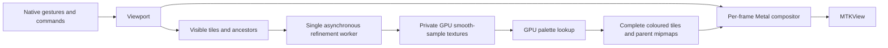

# Renderer architecture through 2.1

The viewer draws from a quadtree cache every display frame. Refinement runs
independently, so moving the camera does not wait for a full-resolution render.
The CPU implementations remain available as numerical references and developer
overrides. `Mandelbrot/Core` also builds as a Swift package for unit tests.

## Samples, precision and keys

`TileGrid` uses 256×256 interior samples and a one-sample gutter on every edge.
A level-L tile spans `3 / 2^L` of the complex plane. Keys contain a level, signed
anchor-relative indices and an anchor epoch; negative parent indices use floor
division. Rebase when indices exceed 2³⁰, retaining coarse old-generation coverage
using its original world bounds. Double coordinates and FloatFloat are sufficient
for this milestone's explicitly capped range; these are not arbitrary-precision
coordinates and do not implement 2.2.

`Viewport` owns coordinate conversion and the conservative FloatFloat zoom cap.
Automatic precision uses Float while pixel spacing has adequate Float-ULP
headroom, then FloatFloat. Both Metal paths retain strict arithmetic. Tile origins
and increments are split on the CPU, avoiding per-pixel FloatFloat division.
Raw R32Float values contain smooth escape counts with bailout radius 256; -1
marks a sample at its iteration cap. A private, unfinished tile uses -2 internally.

## Work and presentation

`TileStore` runs one worker, including across cancellation: a replacement worker
starts only after the old command completes. Work is coarse before fine, then
centre before edges. Invisible work is discarded between commands. An orbit
state buffer makes iteration batches resumable; measured GPU duration adapts the
batch toward 1 ms, bounded to 8–512 iterations over one 258² tile. All kernels
use rounded-up uniform threadgroups and reject out-of-range threads before memory
access; non-uniform threadgroup support is not required. This bounds
submitted arithmetic, not OS scheduling latency or a guaranteed frame deadline.

`GPUCanvas` requests the display's maximum refresh rate and permits at most two
presentation commands in flight. It transforms cached tiles with the current
camera; CPU readback exists only for tests and exports. Scene deactivation and
canvas removal stop refinement and motion. CPU overrides use the legacy image
presentation path.

Each visible cell finds cached ancestors and blends the two nearest levels
according to fractional LOD. New detail fades in over 125 ms. All filtering and
level blending operates on colours, never interpolated escape counts. The debug
overlay draws cell borders and base-level labels in the fragment shader.

When all four children exist, a compute kernel averages their coloured pixels
2×2 into the parent's interior. Its directly sampled gutter remains until adjacent
coverage exists. Raw parent data stays authoritative. Palette changes recolour raw
samples into replacement textures, swap the palette transaction together, and
rebuild derived mipmaps upward. This costs GPU colouring work, but no fractal
iterations or CPU pixel conversion; changing a palette is not literally free.

## Cache policy

Budgets are 150 MiB on iOS and 500 MiB on Mac. Accounting uses Metal's allocated
texture sizes, including colour copies and gutters, rather than assuming a tile
is only its 256 KiB raw payload. Two thirds of the budget, less scratch headroom,
are available for resident tiles; the rest covers recolouring, orbit state and
transient replacements. This is a cache budget, not a cap on total app memory.

Visible tiles and their ancestors are protected. Other records use LRU eviction.
If protected demand would exceed the budget, sampling LOD decreases while the
camera stays fixed. Zoom-in prefetch requests one child level after visible work;
zoom-out's next level is already present in the ancestor chain. Prefetch yields
to visible work and stops at the available budget without eviction churn.

## Validation

`make test` checks fixed Double-reference goldens, smooth samples, CLI errors,
viewport maths and inertia. Headless Metal integration checks resumed computation
against the full kernel byte-for-byte, actual shader blend weights, all parent
mipmap pixels against CPU box averages, raw-texture reuse, palette invalidation,
parent coverage, prefetch, cancellation, LRU budgets and deep anchor rebasing.

`Performance.md` records GPU timings and the meaning of each measurement. Build
validation includes simulator and physical iOS targets. Actual 60 Hz/120 Hz frame
pacing and touch feel on iPhone 11 Pro and iPhone 16 Pro still need device testing.
