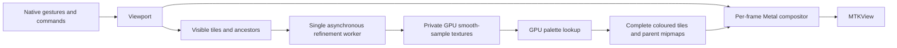

# Renderer architecture through 2.1

The viewer draws from a quadtree cache while motion or refinement changes the image,
and pauses when settled. Refinement runs
independently, so moving the camera does not wait for a full-resolution render.
The CPU implementations remain available as numerical references and developer
overrides. `Mandelbrot/Core` also builds as a Swift package for unit tests.

## Samples, precision and keys

`TileGrid` uses 256×256 interior samples and a one-sample gutter on every edge.
A level-L tile spans `3 / 2^L` of the complex plane. Keys contain a level, signed
anchor-relative indices and an anchor epoch; negative parent indices use floor
division. Rebase when indices exceed 2³⁰, retaining detailed old-generation coverage
using its original precise bounds. Deep coordinates use MIT BigInt fixed point;
spans and local geometry retain a separate binary exponent.

`Viewport` owns coordinate conversion and logarithmic zoom. Automatic precision
uses Float while pixel spacing has adequate Float-ULP headroom, then FloatFloat,
then perturbation. All Metal arithmetic paths retain strict arithmetic. Tile origins
and increments are split on the CPU, avoiding per-pixel FloatFloat division.
Raw R32Float values contain smooth escape counts with bailout radius 256; -1
marks a sample at its iteration cap. A private, unfinished ordinary tile uses -2 internally; perturbation uses -3
for a detected glitch until that pixel is recomputed.

## Work and presentation

`TileStore` runs one worker, including across cancellation: a replacement worker
starts only after the old command completes. Required work is restricted to the
visible level and its two nearest ancestors, coarse before fine within that band,
then centre before edges. Cold jumps therefore get useful nearby detail without
computing every level from the root. Invisible work is discarded between commands. An orbit
state buffer makes iteration batches resumable; measured GPU duration adapts the
batch toward 1 ms: 8–512 ordinary iterations, or 1–128 perturbation/BLA
operations over one 258² tile. All kernels
use rounded-up uniform threadgroups and reject out-of-range threads before memory
access; non-uniform threadgroup support is not required. This bounds
submitted arithmetic, not OS scheduling latency or a guaranteed frame deadline.

`GPUCanvas` requests the display's maximum refresh rate and permits at most two
presentation commands in flight. It transforms cached tiles with the current
camera; texture readback exists only for tests and exports. Perturbation reads
a small shared status buffer to select a glitched pixel for re-referencing. Scene deactivation and
canvas removal stop refinement and motion. CPU overrides use the legacy image
presentation path; their separate input clocks run only during CPU inertia.
Tile completion, palette changes and navigation wake a paused view; motion and
unfinished fades sustain its timer. Unchanged demand returns before allocating
sets or updating LRU state. The hardware HUD distinguishes drawable presentation
cadence from GPU execution time; simulator presentation timestamps are unavailable.
An explicit iOS plist enables ProMotion timing hints and is checked in the built
app by `make ios` and `make ios-device`.

Tile/operation failures receive at most three attempts with delayed retries.
A terminal failure stays stopped until explicit retry or a render-generation reset.
A visible error notice provides recovery even when the developer HUD is hidden.

Each visible cell finds cached ancestors and blends the two nearest levels
according to fractional LOD. New detail fades in over 125 ms. All filtering and
level blending operates on colours, never interpolated escape counts. The debug
overlay draws cell borders and base-level labels in the fragment shader.
Iteration changes retain the old detailed working set as display-only fallback.
Finer old data outranks coarse replacements; new base and fine levels fade against
the previous generation before it is released. Each record stores its iteration
limit. Orbit state is still transient, so this does not yet extend capped pixels.

When all four children exist, a compute kernel averages their coloured pixels
2×2 into the parent's interior. Its gutter remains directly sampled. Raw parent data stays authoritative. Palette changes recolour raw
samples into replacement textures, swap the palette transaction together, and
rebuild derived mipmaps upward. Seven immutable lookup textures are shared. This costs GPU colouring work, but no fractal
iterations or CPU pixel conversion; changing a palette is not literally free.

## Cache policy

Budgets are 150 MiB on iOS and 500 MiB on Mac. Accounting uses Metal's allocated
texture sizes, including colour copies and gutters, rather than assuming a tile
is only its 256 KiB raw payload. Two thirds of the budget, less scratch headroom,
are available for resident tiles; the rest covers recolouring, orbit state and
transient replacements. This is a cache budget, not a cap on total app memory.

Visible tiles and their two nearest ancestor levels are protected. Distant ancestors
remain reusable LRU entries. This review decision replaces the original plan's
requirement to protect the entire chain: the old policy reduced phone detail by
thousands of times at deep zoom. A 1e10 regression now preserves the requested LOD
under the 150 MiB budget, using 12 tiles and 9.375 MiB. Other records use LRU eviction.
If protected demand would exceed the budget, sampling LOD decreases while the
camera stays fixed. Zoom-in prefetch requests one child level after visible work;
zoom-out's next level is already present in the ancestor chain. Prefetch yields
to visible work and stops at the available budget without eviction churn.

## Validation

`make test` checks fixed Double-reference goldens, smooth samples, CLI errors,
viewport maths and inertia. Headless Metal integration checks resumed computation
against the full kernel byte-for-byte, actual shader blend weights, all parent
mipmap pixels against CPU box averages, raw-texture reuse, palette invalidation,
parent coverage, prefetch, cancellation, LRU budgets and deep anchor rebasing.
Independent CPU Double product PNGs cover pixel-centre coordinates, fractional LOD,
offset views and mip boundaries. The original endpoint-mapped lab fixtures remain
fixed, with separate error budgets by precision and location. Injected allocation
failures check retry limits; continuity tests compare pixels across iteration
changes; unchanged-demand tests ensure 120 idle updates schedule no new work.

`Performance.md` records GPU timings and the meaning of each measurement. Build
validation includes simulator and physical iOS targets. Actual 60 Hz/120 Hz frame
pacing and touch feel on iPhone 11 Pro and iPhone 16 Pro still need device testing.

## Before automatic depth or perturbation

The current 65,535 iteration ceiling keeps Float32 smooth-count spacing at or below
1/256. Coordinate depth alone does not reduce this precision. Before permitting
much larger iteration counts, use an integer escape iteration plus a separate
floating smoothing correction, and keep palette phase calculations from collapsing
them back into one large Float. Unresolved and proven-interior status also need
separate representation once periodicity checking is introduced.

Extending capped tiles should preserve escaped samples, but retaining a full orbit
buffer costs about 1 MiB per tile. Design bounded/selective state retention with
2.3; storing coordinates alone only enables recomputation. Larger GPU batches and
multi-tile commands remain measured follow-ups, not prerequisites for the corrected
working-set policy. Do not assume a separate display queue guarantees preemption.

### Deep coordinates and perturbation (2.2)

The camera promotes to fixed-point coordinates before Double navigation loses a
pixel. Zoom is stored logarithmically; spans use a normalized Double mantissa
and a separate binary exponent. Deep tile origins are fixed-point and tile
indices remain local to the anchor. The compositor divides relative distances
by extended spans before converting to screen-space floats. The current explicit
resource limit is 2^13000 zoom (roughly 1e3913), with 128 guard bits, rather than
an accidental FloatFloat or Double underflow limit.

The automatic ladder selects perturbation when pixel spacing needs more than
about 40 coordinate bits. Existing lab Float/FloatFloat renderers remain available.
Reference orbits run in cancellable detached CPU tasks using MIT BigInt fixed
point. Metal computes FloatFloat perturbations with an independent exponent for
each real component. Pauldelbrot cancellation detection marks affected pixels;
subsequent passes recompute only those pixels from a new reference. Critical-point
rebasing also handles exhausted reference orbits. Sixteen reference attempts form
a bounded failure, reported through the existing tile retry UI rather than
publishing known-glitched samples. No per-pixel sample readback occurs in the viewer.

Algorithm sources (equations reimplemented here, no source code copied):
[Claude Heiland-Allen, deep zoom theory and practice](https://mathr.co.uk/blog/2021-05-14_deep_zoom_theory_and_practice.html)
and [rebasing and bilinear approximation](https://mathr.co.uk/blog/2022-02-21_deep_zoom_theory_and_practice_again.html).

BLA builds 32-step leaves and a binary merge hierarchy. Coefficients and validity
radii retain separate exponents during CPU construction as well as GPU use, so
long jumps cannot overflow Double. Each merge reserves five additional guard bits
for accumulated error, constrained by the independent tiled minibrot golden.
The kernel chooses the longest aligned valid jump. `--bla off`, `fixed`, and `on`
compare ordinary perturbation, 32-step leaves, and the hierarchy respectively.
Counters include the longest applied jump and a two-word skipped-iteration sum.
CPU construction and GPU table storage are reserved in the tile memory budget.

Tiles prefer their shared high-precision grid anchor as a reference. A separate
actor caches at most three reference orbits, with a 4 MiB orbit-data cap. Reference
work and BLA preparation are cancellable and off the main actor. At deep zoom the
tile budget reserves up to 12 MiB for reference/cache/state resources before its
existing transactional colour/display headroom. Full-image benchmarks create
fresh references, so end-to-end results do not disguise reference latency with
cache hits. Iteration state retention and automatic iteration depth remain 2.3.
