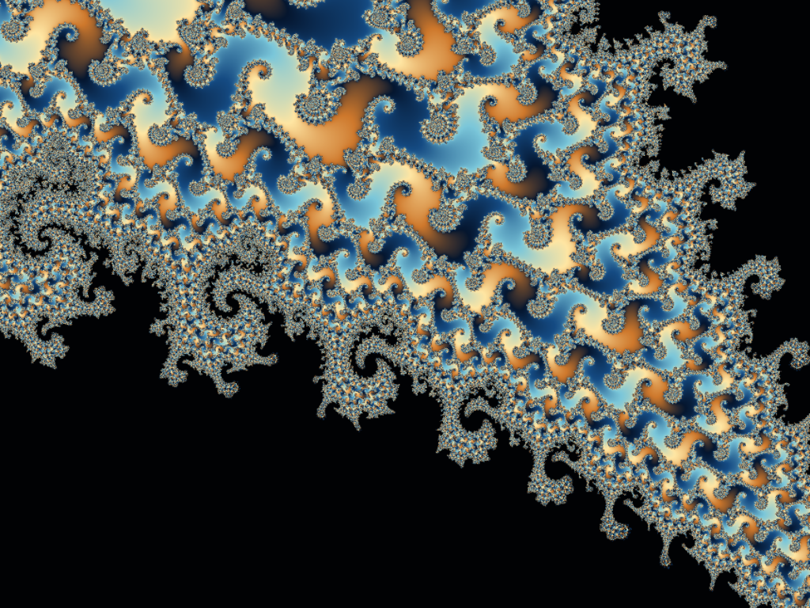

# Mandelbrot

A Mandelbrot set explorer for iPhone, iPad and Mac, in SwiftUI and Metal.
Panning and zooming run at the display's refresh rate at any depth; zoom goes
past 10^1000, with precision stepping from Float to double-float to
perturbation theory on its own; and the set can be bookmarked, shared as a
link, explored beside its Julia sets, and flown through in a rendered movie.



## Where to start reading

1. This README: what the project is, how to build and test it, and where
   things are.
2. [docs/Architecture.md](docs/Architecture.md): how it works and why --
   the tile cache, the precision ladder, colour, memory and testing.
3. The source, a folder at a time. [Where things are](#where-things-are)
   says what each folder holds; the comment at the head of every file says
   what that file is for.
4. [docs/Performance.md](docs/Performance.md): what it costs now and how that
   is measured, with the [history](docs/Performance-history.md) of every
   experiment behind it.
5. [docs/vision.md](docs/vision.md) and [docs/plan.md](docs/plan.md): what
   the app is for, and the roadmap, item by item.

## Building and running

Requires Xcode 26.2 or newer with the Metal toolchain; the app targets
iOS 18 and macOS 15.7. Open `Mandelbrot.xcodeproj` and run, or use the
Makefile, which builds into `/tmp` and never into the source tree:

```sh
make build         # Release macOS app in /tmp/mandelbrot-development
make test          # Core unit tests, then the CLI, golden and integration tests (needs a GPU)
make apptests      # the app's unit and UI tests, on the Mac and an iPad simulator
make ios           # iPhone/iPad simulator build, and a check of the built app
make ios-device    # unsigned device build, and the same check
make format-check  # the committed swift-format convention
make strings       # bring the string catalogue up to date, as Xcode would
make docs-check    # aligned tables and working links in the documents
```

The built app is
`/tmp/mandelbrot-development/Build/Products/Release/Mandelbrot.app`. With no
arguments its executable opens the explorer; with arguments it runs headless,
through the same renderers, and exits. `--help` lists every option:

```sh
APP=/tmp/mandelbrot-development/Build/Products/Release/Mandelbrot.app/Contents/MacOS/Mandelbrot
# A PNG through the viewer's own tile compositor
"$APP" --render --pipeline tiles --renderer perturbation --size 1024x768 \
  --center-real 0 --center-imag 1 --scale 1e1000 --iterations 5000 \
  --density 8 --output deep.png
# Time the GPU renderers on one view
"$APP" --benchmark --pipeline gpu --variants metal,metal-double --sizes 1024x1024
# A zoom movie to any mandelbrot:// link
"$APP" --movie --to 'mandelbrot://view?re=-0.7436&im=0.1318&zoom=4e3' --output zoom.mov
```

**Developer tools** are hidden: tap the version in Settings → About seven
times, or on the Mac hold Option for the Debug menu (launch with
`-DeveloperMenuEnabled YES` to keep it). They hold a renderer override, a
performance HUD, tile borders and the in-app benchmark.

## Testing

There is no CI; `make test` and `make apptests` are run before every commit.
The golden images are never produced by the code they judge: the reference
counts come from the CPU Double renderer, the tiled images from an
independent Python model of the compositor, and the deep fixtures from
Python `Decimal` direct iteration at 1e50, 1e200 and 1e1000 and at a
period-312 minibrot at 1e100. Regenerating one is deliberate: see
[tests/fixtures/README.md](tests/fixtures/README.md), and
[Architecture.md](docs/Architecture.md#testing) for what each layer covers.

## Where things are

| Folder                 | What it holds                                                                              |
| ---------------------- | ------------------------------------------------------------------------------------------ |
| `Mandelbrot/App`       | The entry point, the window, and `ExplorerModel`, the state every view shares              |
| `Mandelbrot/Viewer`    | The Metal views and the native pointer, touch and keyboard input                           |
| `Mandelbrot/Rendering` | The GPU context, the tile cache and its worker, the compositor, perturbation, Julia        |
| `Mandelbrot/Shaders`   | The Metal kernels and the double-float arithmetic they share                               |
| `Mandelbrot/Places`    | Bookmarks, the Places sheets and thumbnails                                                |
| `Mandelbrot/Movies`    | The movie renderer, its sheets and the journey preview                                     |
| `Mandelbrot/Settings`  | Settings, acknowledgements, and the controls both share with the movie sheets              |
| `Mandelbrot/Help`      | The Controls sheet and its words                                                           |
| `Mandelbrot/Developer` | The hidden developer panel and in-app benchmark                                            |
| `Mandelbrot/CLI`       | The headless command line, and in `Diagnostics` the `--test-tiles` integration suite       |
| `Mandelbrot/Lab`       | The early CPU and Metal renderers, kept for benchmarks and tests                           |
| `Mandelbrot/Core`      | The platform-independent mathematics, also a Swift package; `Vendor` holds BigInt          |
| `Mandelbrot/Resources` | Assets and the string catalogue                                                            |
| `Config`               | The Info.plist keys Xcode cannot generate                                                  |
| `tests`                | `core`, `app` and `ui` in Swift; `cli` end to end; `oracles` and the `fixtures` they write |
| `benchmarks`           | The scripts behind each recorded measurement ([README](benchmarks/README.md))              |
| `tools`                | The string-catalogue updater and the document checker                                      |
| `docs`                 | Architecture, performance, the glossary, the vision and plan, reviews and evidence         |

## Status

The explorer, the tile cache, deep zoom, automatic detail and colour,
rotation, places, the Julia companion and zoom movies are built (plan
sections 1 and 2.1–2.11); the pass over every sheet (2.12) is in progress.
Before the App Store (2.18) come still export, periodicity checking and,
above all, hands-on validation on the target phones -- iPhone 11 Pro and
iPhone 16 Pro -- where frame pacing, heat and memory have not yet been
measured (2.15). [docs/plan.md](docs/plan.md) has each item's state.

## Credits

The vendored [BigInt](https://github.com/attaswift/BigInt) (MIT; see its
[provenance](Mandelbrot/Core/Vendor/BigInt/PROVENANCE.md)) carries deep
coordinates and reference orbits. The deep-zoom algorithms -- perturbation,
rebasing and bilinear approximation -- follow Claude Heiland-Allen's
[deep zoom theory and practice](https://mathr.co.uk/blog/2021-05-14_deep_zoom_theory_and_practice.html),
reimplemented from the equations. Settings → About → Acknowledgements shows
both in the app.
