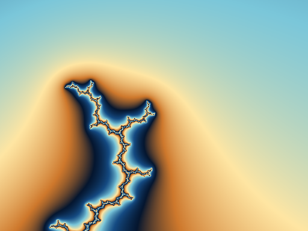

# Mandelbrot

A native SwiftUI and Metal explorer for iPhone, iPad and Mac, with a headless
rendering/performance lab. See [vision](vision.md), [plan](plan.md), and the
[implementation record](Implementation.md).

Requires Xcode 26.2 or newer with the Metal toolchain. Targets iOS 18+ and macOS
15.7+. The MIT-licensed BigInt sources are vendored for offline builds; see
[provenance](Mandelbrot/Core/Vendor/BigInt/PROVENANCE.md).

```sh
make build       # Release macOS app in /tmp/mandelbrot-development
make test        # Swift unit + CLI + CPU/GPU golden-image tests; GPU required
make ios         # iPhone/iPad simulator build + generated plist check
make ios-device  # unsigned physical-iOS build + generated plist check
make format-check # enforce the committed Swift formatting convention
```

Run `/tmp/mandelbrot-development/Build/Products/Release/Mandelbrot.app/Contents/MacOS/Mandelbrot`
with no arguments for the viewer, or `--help` for headless rendering/benchmarks.
[Performance.md](Performance.md) documents timings, precision, and CLI examples.

`Mandelbrot/Core` contains the independently tested numerical and navigation
models. SwiftUI views coordinate through `ExplorerModel`; `RendererRegistry`
provides the CPU/GPU laboratory implementations. Legacy escape-count fixtures
remain fixed so renderer changes can be checked against an independent reference.

Developer tools: in Settings → About, tap the version seven times. On Mac, hold
Option to reveal Debug, or launch with `-DeveloperMenuEnabled YES` to keep that
menu available. The main view uses automatic precision; the developer panel has
renderer overrides, benchmark sharing, a HUD, and tile overlays. Benchmark scope
can be GPU compute only or end-to-end (GPU computation/colouring; CPU legacy
rendering). Reports include the device and exact viewport.

The viewer now uses a GPU quadtree cache with parent fallback, colour-level
blending, refinement fades, upward mip averaging, prefetching and LRU budgets.
See [Architecture.md](Architecture.md) for the data flow and precision limits.
Precision now steps automatically from Float to FloatFloat to GPU perturbation.
The camera retains high-precision coordinates and supports zooms through 2^13000
(about 1e3913). Settings → Detail defaults to a depth-based iteration estimate.
Use the detail multiplier, or turn automatic off to enter a manual limit, up to
1,000,000 GPU iterations. The keyboard increase/decrease commands use the same
controls. Pixel-driven adaptation remains future work. Settings → About →
Acknowledgements contains the BigInt MIT notice and algorithm credits.

Export the same tiled compositor without opening a window:

```sh
/tmp/mandelbrot-development/Build/Products/Release/Mandelbrot.app/Contents/MacOS/Mandelbrot \
  --render --pipeline tiles --renderer metal-double --size 1024x768 \
  --center-real -0.743643987037151 --center-imag 0.13182597420533 \
  --scale 10000000 --iterations 2000 --palette blue-gold --output deep.png
```


The user has reported smooth navigation on a phone and Mac. The review fixes add
bounded retries, a small deep working set, iteration-change continuity and idle
sleeping. Physical frame pacing and the revised full-screen touch layout still
need device verification. The [implementation record](Implementation.md) tracks
completed work and the remaining validation. Independent CPU product-image
references run as part of `make test`; regenerate deliberately with
`python3 tests/test_product_golden.py --record`.

Deep export and a controlled BLA benchmark (no window):

```sh
APP=/tmp/mandelbrot-development/Build/Products/Release/Mandelbrot.app/Contents/MacOS/Mandelbrot
"$APP" --render --pipeline tiles --renderer perturbation --size 512x384 \
  --center-real 0 --center-imag 1 --scale 1e1000 --iterations 5000 \
  --density 8 --output deep-1000.png
"$APP" --benchmark --pipeline gpu --variants perturbation --sizes 256x192 \
  --center-real 0 --center-imag 1 --scale 1e1000 --iterations 5000 \
  --runs 3 --warmup 1 --bla on --format json
```

Use `--bla off` for no approximation, `--bla fixed` for 32-step blocks, or
`--bla on` (the default) for the hierarchy. Kernel timing excludes CPU reference
preparation; end-to-end timing includes it. JSON preserves decimal coordinate and
scale strings, and omits the numeric scale when it exceeds Double range.



The 1e50, 1e200 and 1e1000 sample and PNG goldens come from independent Python
Decimal direct iteration. Reproduce them deliberately with
`python3 tests/precision/oracle.py` followed by
`python3 tests/precision/colour_goldens.py`. The renderer comparison and evidence
capture script is `python3 tests/precision/measure.py "$APP"`.

The review adds a non-flat period-312 minibrot golden at 1e100 with orbits above
20,000 iterations, including an independent tiled PNG. Final measurements and
[rendered evidence](evidence/review-deep/final-gpu.png) are in
[Performance.md](Performance.md). `--sample-records PATH` exports exact UInt32
counts with separate Float32 corrections for high iteration limits; legacy
UInt16 counts and combined `--samples` exports remain limited to 65,535.
Reproduce the benchmark-only Boost comparison with
`python3 tests/precision/reproduce.py`.
