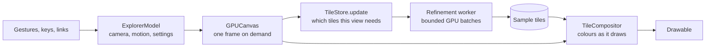

# Architecture

How the explorer is built, and why it is built that way. Each section names
the files that implement it; the comment at the head of each file says what
that file is for, and the code carries the detail. The numbers behind the
decisions are in [Performance.md](Performance.md) and its
[history](Performance-history.md); where the folders are is in the
[README](../README.md#where-things-are).

The one idea everything else serves: **the screen never waits for the
Mandelbrot set.** Every frame is drawn from samples already computed, at
whatever resolution they exist, while a worker refines the view in the
background and new detail fades in. That is what keeps pan and zoom at the
display's refresh rate at any depth.

## Layers

- **Core** (`Mandelbrot/Core`) is the mathematics with no UI and no Metal: the
  camera, tile geometry, arbitrary precision, reference orbits and BLA, the
  iteration and colour policies, places, movie paths and the CPU lab
  renderers. It is also a Swift package, so `swift test` exercises it without
  building the app.
- **Rendering** and **Shaders** do the GPU work: the tile store and its
  worker, the compositor, perturbation, the Julia companion, and the Metal
  kernels they drive. `GPUContext` owns the device, queues and pipelines.
- **App**, **Viewer** and the feature folders (**Places**, **Movies**,
  **Settings**, **Help**, **Developer**) are SwiftUI and native input.
  `ExplorerModel` is the one object a window's views share; it holds the
  camera and settings and knows nothing about tiles beyond asking the store
  for statistics.
- **CLI** and **Lab** are for measuring. The command line renders, benchmarks
  and runs the integration suite headless, through the same renderers the
  viewer uses; the lab renderers are the early CPU and Metal experiments,
  kept as benchmark subjects and test variants, never drawn by the viewer.

## A frame

Drawing is event driven. Tile completion, a changed setting, a resize and
waking from the background all call `ExplorerModel.requestRedraw`, and
`GPUCanvas` answers with one frame. Only while something moves -- inertia, a
spring, a fade -- does the view run on its display timer, so a still view
costs nothing. Each frame:

1. advances the model's motion by the time since the last frame
   (`Core/Navigation/Motion.swift` integrates decay analytically, so a fling
   travels the same distance at 60 Hz, 120 Hz or with a dropped frame);
2. tells the tile store the current view, which updates its demand -- an
   unchanged view returns before allocating anything;
3. encodes the compositor: for each cell of the visible level, the best
   records available at the coarse, base and fine levels and their fade,
   drawn as one quad whose fragment shader colours the samples.

At most two frames are in flight. The canvas is `Viewer/GPUCanvas.swift`,
the compositor `Rendering/TileCompositor.swift`, its shaders
`tileVertex`/`tileFragment` in `Shaders/GPUCompute.metal`.

## Tiles

The plane is cut into a quadtree (`Core/Tiles/TileGrid.swift`). A tile holds
256×256 samples plus a one-sample gutter on every edge, so bilinear filtering
is continuous across tile boundaries; a level-L tile spans `3 / 2^L`. Keys
are indices relative to an anchor, so they stay small at any depth, and the
grid is rebased when they grow past 2³⁰. A rotated view is covered by its
bounding box: tiles stay axis-aligned in the plane and only the compositor
turns them, so rotating never invalidates anything.

**Demand** (`Rendering/TileStore.swift`). The store computes the visible
level from the zoom and the drawable's width, then requires that level and
its two nearest ancestors, coarse before fine and centre before edges -- so a
cold jump shows useful detail quickly without computing every level from the
root. Beside it, a **coverage pyramid** keeps a root tile and a ladder of
zoom-out levels in a reservation of its own (a tenth of the budget, at least
30 MiB, at most 64 tiles), so zooming out never shows a hole, and
**prefetch** requests one level deeper in the direction of a zoom. Work that
stops being needed is dropped between batches.

**Presentation.** Each cell blends its two nearest levels by the fractional
level of detail, and a newly arrived tile fades in over 125 ms (instantly
under Reduce Motion). A missing tile falls back to its nearest cached
ancestor, and an ancestor is always drawn from its own samples at its own
resolution.

**Refinement.** One worker refines up to two tiles at a time, in batches of
iterations it can resume from saved orbit state. Each batch aims at about
1 ms of GPU time, measured, so a batch can grow to thousands of iterations on
a cheap view and stay small on a costly one; the GPU is shared with the
display, and no batch holds it for long. The last batch of a tile also
computes its statistics in the same command buffer, which saves round trips.
A tile or operation that fails is retried at most three times, with a delay;
after that the view offers "Try Again".

## Samples and colour

A sample is eight bytes (`Core/Precision/SampleRecord.swift`,
`Shaders/SampleRecord.h`): the exact escape iteration as a UInt32 and the
smooth-colouring correction as a Float32, with a bailout radius of 256. Three
reserved counts mark a pixel as capped (unresolved at this limit, not proven
interior), unfinished or glitched. Keeping the count exact and the correction
separate preserves smooth shading at a million iterations, where a single
float could not.

Tiles hold only samples. The compositor colours as it draws: within a level
it colours the four samples around each point and blends the colours, then
blends levels, so filtering never interpolates escape counts (which would
invent colours across the set's boundary). The palette, the colour mapping
and the iteration cap's marking of capped pixels are all draw-time uniforms,
so changing any of them never touches the cache. The seven palettes are 1D
lookup textures built once (`Core/Colour/Palette.swift`).

By default colour follows depth deterministically
(`Core/Colour/AutomaticColour.swift`): the same place always looks the same,
whatever is cached and however it was reached, and a still camera never
flickers. "Tune colours to this view" fits the visible counts once and pins
the result; a movie with pinned colours plans its colours before it renders.

Every renderer samples pixel `(x, y)` of a region at its centre,
`left + (x + 0.5) * step`: the tiles, the full-frame GPU paths, perturbation
and the lab renderers alike, so their outputs line up and the golden
fixtures mean the same thing for all of them.

## Precision

Which renderer a view needs depends on how many coordinate bits one pixel
takes (`Core/Precision/PrecisionPolicy.swift`):

| Pixel spacing                                    | Renderer     | Where                                            |
| ------------------------------------------------ | ------------ | ------------------------------------------------ |
| Coarse enough for Float's unit in the last place | Float        | `renderSamples`, `resumeTile` (GPUCompute.metal) |
| Up to about 40 bits                              | FloatFloat   | the same kernels, double-float arithmetic        |
| Beyond                                           | Perturbation | `perturbTile` (Perturbation.metal)               |

Metal has no double, so FloatFloat carries each value as the unevaluated sum
of two floats (`Shaders/FloatFloat.h`, about 48 bits). Its error-free
transforms depend on each operation rounding where written, so fast math is
off and multiply-add contraction is disabled inside those functions only:
the plain Float kernels keep their contractions.

The camera itself switches to binary fixed point on the vendored BigInt
before Double would lose a pixel, and stores zoom as a logarithm
(`Core/Navigation/Viewport.swift`, `Core/Precision/DeepNumber.swift`), so
navigation is exact to 2^13000, about 10^3913.

**Perturbation** (`Rendering/PerturbationRenderer.swift`) iterates each
pixel's difference from one reference orbit computed at full precision on
the CPU (`Core/Precision/ReferenceOrbit.swift`). The differences are
FloatFloat mantissas with exponents of their own, so they survive at 1e1000.
Around it:

- *References* are computed in cancellable background tasks, shared between
  tiles through a budgeted cache that accepts a nearby orbit of enough
  precision, and streamed: the GPU starts with the first 4,097 iterations and
  pixels pause at the frontier while the orbit extends.
- *Bilinear approximation* (`Core/Precision/BilinearApproximation.swift`)
  lets a pixel skip up to thousands of iterations where the orbit is locally
  linear. Coefficients and radii keep separate exponents even on the CPU, so
  long jumps cannot overflow Double.
- *Rebasing* restarts a pixel against the start of the reference whenever
  its own value becomes smaller than its difference from the reference
  (|Z + z| < |z|), which avoids most glitches; *Pauldelbrot detection* marks the rest, and later passes
  recompute only those pixels from a new reference, sixteen at most.

The algorithms follow Claude Heiland-Allen's
[deep zoom theory and practice](https://mathr.co.uk/blog/2021-05-14_deep_zoom_theory_and_practice.html)
and [its sequel](https://mathr.co.uk/blog/2022-02-21_deep_zoom_theory_and_practice_again.html);
the equations were reimplemented, no code copied. BLA's validity radius keeps
five guard bits per merge. A fixed five-bit margin per jump passes the
isolated-jump tests but not the tiled minibrot image budget, so it remains an
experiment behind `--bla-radius fixed`: a measured limit of the validation,
not a proof that compounding is necessary.

## Iteration depth

Automatic detail (`Core/Precision/IterationPolicy.swift`) starts from an
estimate that grows with depth, `200 + 80·log2(scale)` rounded up to steps of
200, scaled by the detail setting. Once every visible tile is complete, it
lowers the limit to twice the highest escaped count in view, which is exact:
nothing that escapes is lost. Changes need 10% or 200 iterations to take
effect, and decreases wait until motion stops. Raising the limit from data
needs interior detection -- a capped pixel may be inside the set or merely
unresolved -- and belongs to plan 2.14.

A changed limit keeps the cache. A lower one only changes which counts the
compositor marks as capped; a higher one copies each tile's escaped samples
and recomputes only its capped pixels, and a tile with none satisfies any
limit. The product ceiling is 1,000,000 iterations.

## Memory

The tile budget is 150 MiB on iOS and 500 MiB on the Mac, counted in Metal's
allocated sizes. Deep views first reserve room for reference orbits, BLA
tables and perturbation state; of the rest, a third is kept back for orbit
state, frames in flight and headroom. Visible tiles and their two nearest
ancestor levels are protected, the coverage pyramid has its own
reservation, and everything else is evicted least recently used. If the
protected set alone would not fit, the store samples at a coarser level
rather than moving the camera. A 1e10 view keeps full detail on a phone's
budget using 12 tiles.

## Navigation, places, the companion and movies

- **Rotation** turns Double offsets from the screen centre, never the deep
  centre itself, so it costs no precision (`Viewport.angle`).
- **Motion**: inertia, the gentle-bounds springs, the compass return and the
  snap to right angles all use the same analytic decay
  (`ExplorerModel.advanceMotion`).
- **Places** (`Core/Places/Location.swift`): a view as decimal strings --
  centre, zoom, rotation, detail, palette -- is the one currency for
  `mandelbrot://` links, bookmarks, history, the famous places and a movie's
  ends. Going to a place travels there as a short movie would, unless Reduce
  Motion is on.
- **The Julia companion** (`Rendering/JuliaRenderer.swift`) is one small
  whole-panel render per change, not a second tile cache: it is small, drawn
  whole and never deep. It shares the sample format, palettes and colouring.
- **Movies** (`Movies/MovieRenderer.swift`): `Journey` plans the route -- a
  straight descent when one place lies inside the other, otherwise out to a
  shared overview, across and in -- and paces it honestly. A descent renders
  one keyframe per zoom level through an ordinary tile store, and composes
  each output frame from the two keyframes that bracket it through an affine
  map, so only two keyframes are ever resident. A route with travel renders
  each frame directly. AVAssetWriter encodes straight from Metal textures.

## Testing

No CI: `make test` and `make apptests` run everything locally, and the plan
asks for both before each commit.

| Layer                       | Where                                         | What it checks                                                     |
| --------------------------- | --------------------------------------------- | ------------------------------------------------------------------ |
| Core unit tests             | `tests/core` (`swift test`)                   | geometry, precision, policies, places, paths                       |
| App tests                   | `tests/app`, `tests/ui`                       | the model as the UI drives it, input, keyboard routes, movie sheet |
| Integration, on the GPU     | `Mandelbrot/CLI/Diagnostics` (`--test-tiles`) | tiles, compositor, kernels, navigation, companion, movies          |
| End to end, through the CLI | `tests/cli`                                   | exports, errors, goldens at every depth                            |
| Independent references      | `tests/oracles`, `tests/fixtures`             | the numbers the goldens are compared with                          |

The goldens are never produced by the renderers they judge. The legacy
fixtures are CPU Double counts; the tiled product images come from a
Python float64 model of the compositor; the deep fixtures from Python
`Decimal` direct iteration at 1e50, 1e200 and 1e1000 and a period-312
minibrot at 1e100. Tolerances are per precision and per location, with the
reasons in `tests/fixtures/README.md`.

## What is not yet validated

Every measurement so far is from one Mac. Frame pacing at 60 and 120 Hz,
touch feel, heat and memory on the target phones (iPhone 11 Pro and 16 Pro)
are plan 2.15; the headless tests and simulator builds do not stand in for
them. [Performance.md](Performance.md#not-yet-measured) lists what else is
unmeasured.
