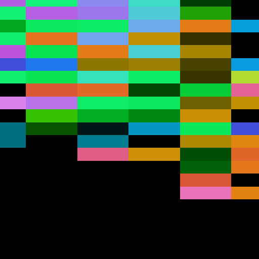
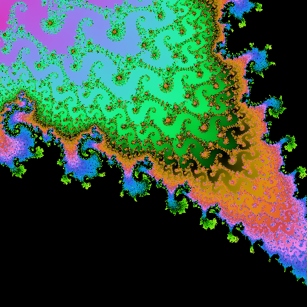
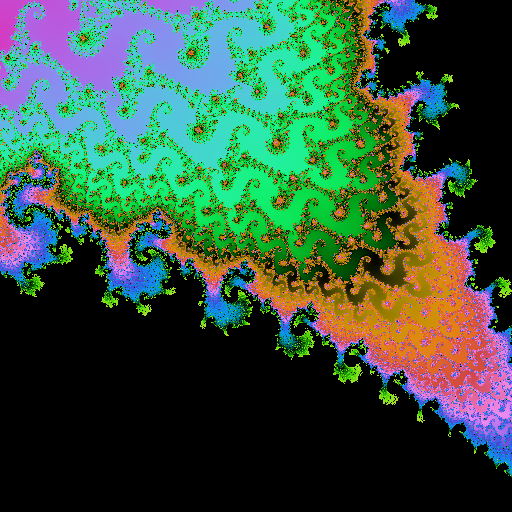

# FloatFloat deep-zoom investigation

Recorded in January 2026, when the renderers sampled the edges of the view
rather than pixel centres; a rerun today will not match these images bit for
bit. Paths below are the repository's current ones.

## Diagnosis and fix

Both Xcode configurations had `MTL_FAST_MATH = YES`. The actual compiler invocation
used `-fmetal-math-mode=fast -fmetal-math-fp32-functions=fast`. FloatFloat relies on
the rounding errors of individual operations: for example, in `dd_normalize`,
`lo - (sum - hi)` recovers the part lost when `sum = hi + lo` rounds to Float.
Algebraic reassociation can simplify that residual to zero. The same problem
affects the error-free addition/subtraction transforms. Apple's
[Metal fast math documentation](https://developer.apple.com/documentation/metal/mtlmathmode/fast)
describes the mode's potentially lossy arithmetic assumptions.

The fix disables Metal fast math in Debug and Release. Compiler logs confirm
`-fmetal-math-mode=safe -fmetal-math-fp32-functions=precise`. The shader also disables
implicit multiplication/addition contraction with `#pragma clang fp contract(off)`;
the explicit `fma` in `dd_mul` remains intentional, recovering the error of a
separately rounded product. Two smaller precision leaks are fixed: the aspect
ratio is calculated using FloatFloat, and the escape comparison checks both
components without first rounding their sum back to Float.

The normal Float kernel shares this compilation unit, so its math settings change
too. Both its before and after results are retained. FloatFloat stores roughly
48 significant bits, compared with Double's 53; differences near sensitive escape
boundaries remain. CPU Double is the comparison reference, not an exact oracle.

## Selecting the viewport

Exploration started at `(-0.743643887037151, 0.13182590420533)` with scales 100,000,
1,000,000, and 10,000,000, then tested northwest and southeast offsets at the deepest
scale. The northwest viewport retains more visible structure; the southeast
viewport is mostly black. PNGs and counts from these trials are in `exploration/`.

The final viewport is identical for every comparison and benchmark:

- Center: **(-0.743643987037151, 0.13182597420533)**
- Scale: **10,000,000**, giving a horizontal span of **3e-7**
- Image: **512 × 512**, block size 1, iteration cap **2000**
- Benchmark sizes: **512 × 512** and **1024 × 1024**

Float spacing near this real coordinate is `2^-24 ≈ 5.96e-8`; near the imaginary
coordinate it is `2^-26 ≈ 1.49e-8`. At 512 pixels, these correspond to approximately
101.5 and 25.4 pixel spacings. Raw counts confirm repeated columns in runs of
101–102 pixels and repeated rows in runs of 25–26 pixels, producing constant blocks
larger than 16 × 16. These are coordinate quantization artifacts in full-resolution
renders, not progressive preview blocks. The old FloatFloat image has the same
column-run pattern and only six distinct columns; the fixed image has 512.

## Images and numerical evidence

| Original FloatFloat | Corrected FloatFloat | CPU Double reference |
| --- | --- | --- |
|  |  |  |

Also retained: [original Float](float-before.png) and [Float with strict arithmetic](float-after.png).

Accuracy is measured on raw escape counts, independent of palette quantization.
`accuracy.json` records exact-match rates, mean absolute errors, distinct counts,
and repeated row/column runs. The escaped-pixel metric excludes pixels where the
CPU reaches the cap, so a flat black image cannot score well by matching those.

The GPU accuracy regression passes for 512 × 512 and 513 × 257 viewports; it fails
against the old shader (only 0.27% exact agreement on escaped reference pixels).
All eight CLI integration tests pass with Metal testing enabled.

## Reproduction

Build and render using the commands in [Performance.md](../../Performance.md),
including `ENABLE_CODE_COVERAGE=NO`. The scheme otherwise adds Swift profiling
instrumentation even for Release builds. The original PNGs use the original
shader; final before/after timings use the same uninstrumented host executable,
with the original or corrected `default.metallib` respectively.

The capture helper accepts an explicit build and phase:

```sh
python3 benchmarks/capture_floatfloat.py /path/to/original/Mandelbrot before docs/evidence/floatfloat
python3 benchmarks/capture_floatfloat.py /path/to/fixed/Mandelbrot after docs/evidence/floatfloat
python3 benchmarks/analyze_floatfloat.py docs/evidence/floatfloat > docs/evidence/floatfloat/accuracy.json
MANDELBROT_TEST_METAL=1 python3 tests/cli/test_headless.py /path/to/fixed/Mandelbrot
```

The original shader source is archived as `original-shader.metal` (from commit
`18dd5e3`). It must be compiled with fast math to reproduce the bug. The capture
script writes PNGs and `.u16` count files, then runs one process per renderer/size
with one warmup and five measured samples. Each reported time is the median;
throughput is pixel count divided by that median. Timing includes iteration
computation, allocations, GPU synchronization/readback, and CPU colorization.
PNG/count export is not timed. Runs are sequential with no concurrent rendering.

Raw benchmark samples are in `benchmarks-before.json` and `benchmarks-after.json`;
hardware and compiler metadata are in `environment.json`.

To recreate an original-shader executable from a current build without changing
the working tree, copy the app and replace only its shader library:

```sh
cp -R /tmp/mandelbrot-build/Build/Products/Release/Mandelbrot.app /tmp/mandelbrot-original.app
xcrun --sdk macosx metal -c -target air64-apple-macos15.7 \
  -fmetal-math-mode=fast -fmetal-math-fp32-functions=fast \
  docs/evidence/floatfloat/original-shader.metal -o /tmp/mandelbrot-original.air
xcrun --sdk macosx metal -target air64-apple-macos15.7 \
  /tmp/mandelbrot-original.air \
  -o /tmp/mandelbrot-original.app/Contents/Resources/default.metallib
python3 benchmarks/capture_floatfloat.py \
  /tmp/mandelbrot-original.app/Contents/MacOS/Mandelbrot before docs/evidence/floatfloat
```

## Accuracy results

| Renderer | Exact counts vs CPU Double | Exact on escaped pixels | Mean absolute count error |
| --- | ---: | ---: | ---: |
| Float before | 37.34% | 0.15% | 223.966 |
| FloatFloat before | 35.04% | 0.27% | 222.976 |
| Float after (strict math) | 36.37% | 0.23% | 233.794 |
| FloatFloat after | 95.72% | 92.36% | 2.634 |

The FloatFloat mean absolute iteration error falls by approximately 84.7×.
The reference and corrected FloatFloat each contain 1493 distinct iteration counts;
the original FloatFloat has just 70.

## Performance results

Measured on **Apple M1 Pro**, macOS 26.6, Xcode 26.6, Release with coverage disabled.
Median of five measured runs after one warmup per renderer/size. All use the viewport above.

| Renderer | 512 × 512 seconds / Mpx/s | 1024 × 1024 seconds / Mpx/s |
| --- | ---: | ---: |
| Before metal | 0.008907 / 29.43 | 0.031784 / 32.99 |
| Before metal-double | 0.013307 / 19.70 | 0.035664 / 29.40 |
| After baseline | 1.237863 / 0.21 | 5.137067 / 0.20 |
| After scalar-tight | 1.226442 / 0.21 | 5.015623 / 0.21 |
| After coord-precompute | 1.237577 / 0.21 | 5.048249 / 0.21 |
| After unsafe-buffer | 1.266963 / 0.21 | 5.059035 / 0.21 |
| After float-math | 1.296334 / 0.20 | 5.131370 / 0.20 |
| After parallel | 0.184198 / 1.42 | 0.827137 / 1.27 |
| After simd4-float | 1.437647 / 0.18 | 5.665252 / 0.19 |
| After metal | 0.009660 / 27.14 | 0.035390 / 29.63 |
| After metal-double | 0.028295 / 9.26 | 0.104593 / 10.03 |

At 1024 × 1024 the corrected FloatFloat renderer is **7.9× faster** than parallel CPU Double. It costs **2.93×** the time of the old, inaccurate FloatFloat shader.
Float and SIMD Float timings remain measurements of a quantized image at this zoom;
only the Double CPU variants and corrected FloatFloat resolve the selected detail.
Single-machine timings have ordinary run-to-run variation; all samples are retained.
